# DevSecOps HomeLab: Od Infrastruktury po Aktywną Detekcję

**Wprowadzenie:** 
Projekt DevSecOps HomeLab to moje autorskie środowisko testowe, w którym w praktyce uczę się umiejętności DevSecOps.\
Projekt ten to moje portfolio – stworzyłem je, aby przekuć wiedzę akademicką w realne umiejętności. \
Samodzielnie zbudowałem tu infrastrukturę, napisałem skrypty automatyzujące, a następnie przeprowadziłem kontrolowane ataki, by na koniec zaprogramować własny mechanizm detekcji intruzów.

> 💡 **Wskazówka:** GitHub po cofnięciu strony domyślnie zwija wszystkie otwarte sekcje. Aby wygodnie przeglądać galerie zdjęć (zrzuty ekranu) i nie tracić postępu czytania, polecam klikać w nie **środkowym przyciskiem myszy (scrollem)**, by otworzyć je w nowej karcie.

Poniższe diagramy przedstawiają architekturę sieciową oraz przepływ pracy w projekcie.

---

<b>🌐 Architektura Infrastruktury i Sieci</b>

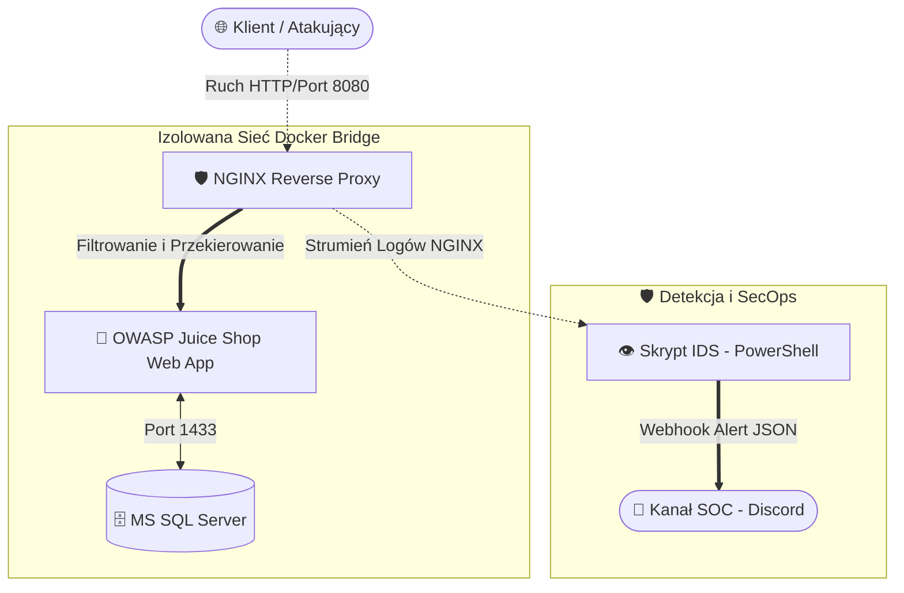

---

<b>🗺️ ROADMAP Projektu </b>

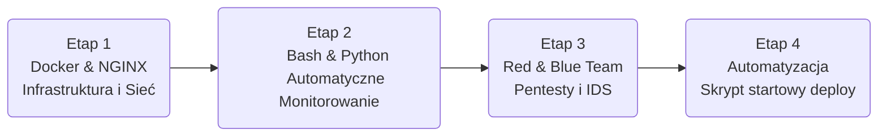

---

<b>🏗️ ETAP I: Architektura Infrastruktury i Sieci (Docker & NGINX)</b>

Zaprojektowanie fundamentów projektu opartych na konteneryzacji. Głównym założeniem było stworzenie środowiska, które od samego początku realizuje zasady *Security by Design* (m.in. izolacja sieciowa i pojedynczy punkt wejścia).

**🎯 Cel** \
Postawienie odizolowanego środowiska kontenerowego: webowej aplikacji testowej ukrytej za Reverse Proxy oraz niezależnego serwera bazy danych MS SQL, który służy mi jako środowisko do testowania anonimizacji danych.

**🛠️ Wykorzystane Technologie** \
`Docker`, `Docker Compose`, `NGINX`, `Linux`

**🚀 Kluczowe wdrożenia**
* **Izolacja Aplikacji:** Wdrożenie wewnętrznej sieci typu Bridge, całkowicie ograniczającej bezpośredni dostęp z zewnątrz do podatnej aplikacji webowej (ukrytej za bramą proxy).
* **Reverse Proxy:** Konfiguracja serwera NGINX (port 8080) jako jedynej bramy wejściowej do ukrytej, celowo podatnej aplikacji OWASP Juice Shop.
* **Hardening Serwera:** Implementacja reguł *Rate Limiting* w celu mitygacji ataków typu Brute Force oraz DoS (odrzucanie ruchu po przekroczeniu limitu zapytań).
* **Zarządzanie Sekretami:** Zabezpieczenie haseł poprzez wdrożenie dynamicznych zmiennych środowiskowych (`.env`).

<b>📸 Proof of Work</b>

**1. Architektura i dostęp przez Reverse Proxy**
> Pomyślne przekierowanie ruchu przez NGINX do aplikacji docelowej, przy jednoczesnym zablokowaniu bezpośredniego dostępu do kontenera z pominięciem bramy.

 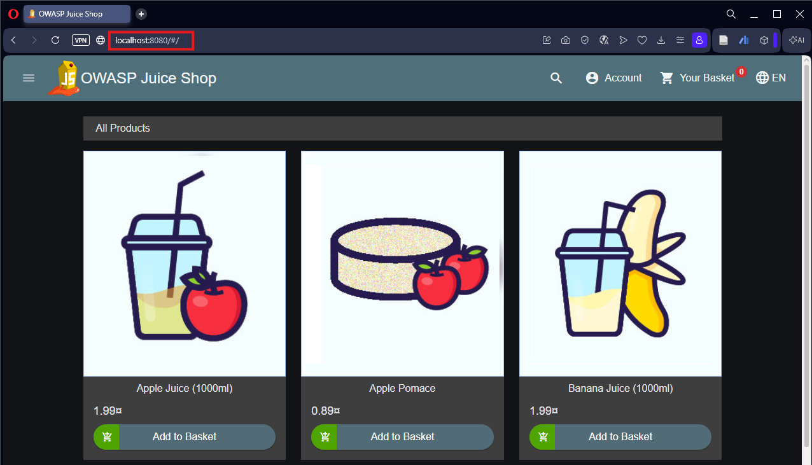
 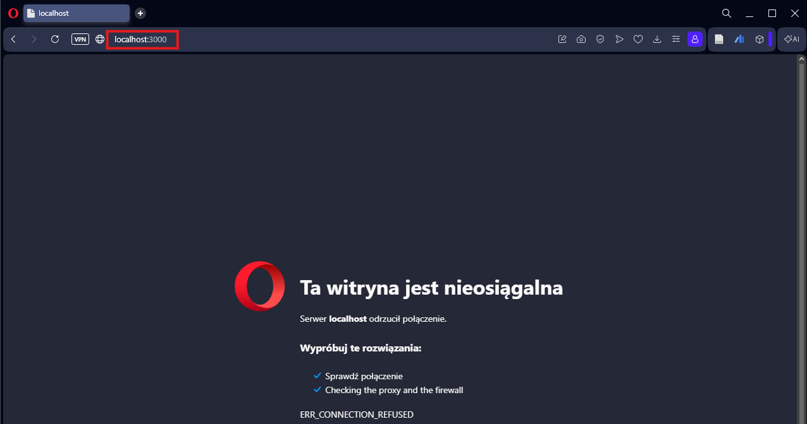

**2. Weryfikacja zabezpieczeń (Rate Limiting)**
> Pomyślne zablokowanie ataku wolumetrycznego i zwrócenie błędu 503 (Service Temporarily Unavailable) po przekroczeniu dozwolonej liczby żądań.

  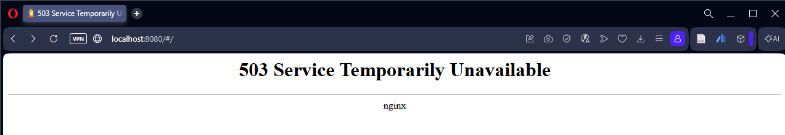

**3. Inicjalizacja bazy danych w izolowanym kontenerze**
> Pomyślny start kontenera MSSQL Server, który w Etapie II posłużył mi do nauki zarządzania wrażliwymi danymi (PII).

  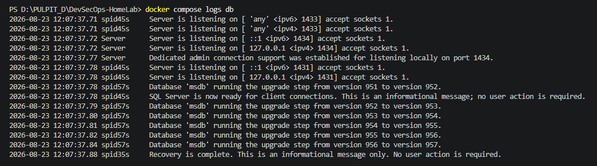

---

<b>⚙️ ETAP II: Automatyzacja, Monitoring (Bash) i SecOps (Python)</b>

Wdrożenie mechanizmów automatyzujących administrację systemem oraz reagowanie na zdarzenia krytyczne. Etap ten integruje system logowania z komunikatorem zewnętrznym oraz zapewnia zgodność z procedurami ochrony danych.

**🎯 Cel**\
Stworzenie systemu monitorującego zasoby serwera i logi bezpieczeństwa w czasie rzeczywistym oraz zaimplementowanie mechanizmu inteligentnej anonimizacji danych wrażliwych (zgodność z RODO) bezpośrednio na poziomie bazy danych.

**🛠️ Wykorzystane Technologie**\
`Bash`, `Cron`, `MS SQL (sqlcmd)`, `Python (Faker, pymssql)`, `Discord Webhooks API`

**🚀 Kluczowe wdrożenia**
* **Skrypt Monitorujący (SysAdmin):** Napisanie dedykowanego skryptu w języku Bash, który w sposób ciągły analizuje zużycie RAM/CPU (`free`, `top`) oraz weryfikuje systemowy plik `/var/log/auth.log` pod kątem nieudanych prób logowania (SSH).
* **Event-Driven Alerts:** Integracja skryptu monitorującego z Discord Webhooks za pomocą narzędzia `curl`, przesyłająca sformatowane powiadomienia JSON w momencie wykrycia anomalii.
* **Automatyzacja:** Wdrożenie demona `cron` do cyklicznego, bezobsługowego uruchamiania skryptu.
* **Data Seeding & Anonimizacja:** Ręczne zainicjowanie bazy MS SQL danymi PII (Personally Identifiable Information), a następnie z pomocą AI, opracowanie skryptu w Pythonie wykorzystującego bibliotekę *Faker*. Skrypt wykonuje pełny backup (`.bak`), a następnie w bezpieczny sposób (Parameterized Queries) anonimizuje prawdziwe dane, zachowując spójność formatów (np. prawidłowe sumy kontrolne dla numerów PESEL).

<b>📸 Proof of Work</b>

**1. Logika monitoringu i alerty Discord w czasie rzeczywistym**
> Skrypt Bash (odczyt zmiennych, instrukcje warunkowe, payload JSON) zintegrowany z harmonogramem Cron oraz widoczne alerty systemowe dostarczone na kanał deweloperski. *(na potrzeby testów i zaprezentowania alertów na komunikatorze, próg alarmowy RAM został chwilowo podniesiony).*

  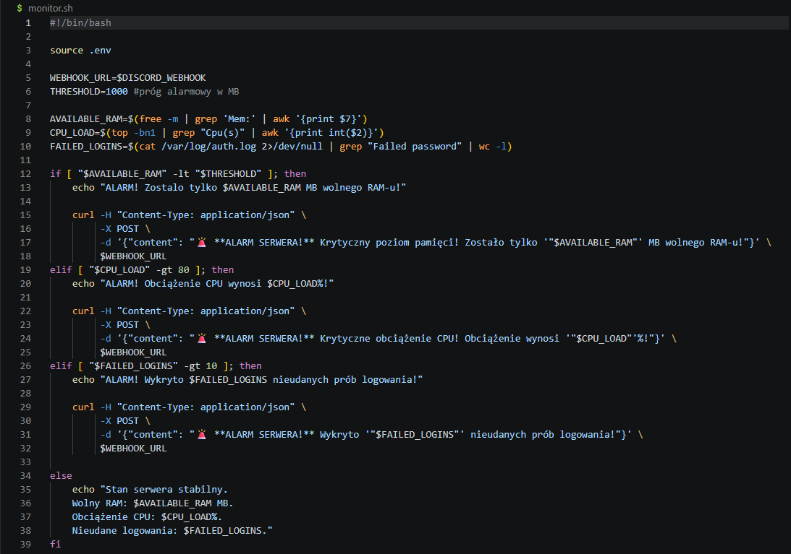
  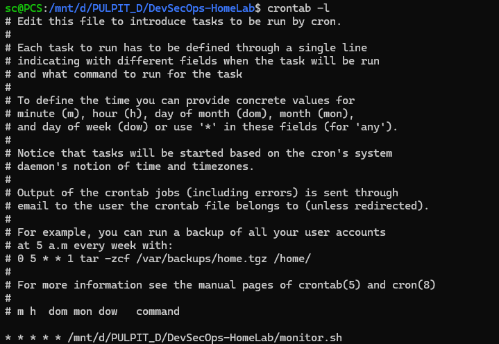

  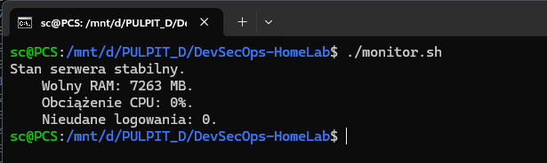
  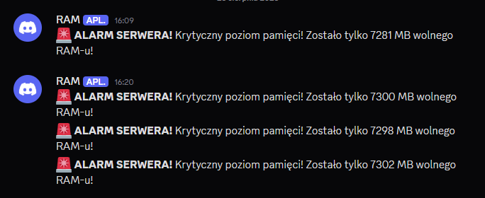

**2. Operacje na danych (SQL Seeding)**
> Bezpośrednia interakcja z kontenerem bazy danych poprzez natywny interfejs `sqlcmd`. Inicjalizacja tabeli i pomyślne wprowadzenie testowych danych wrażliwych (imiona, e-mail, PESEL).

  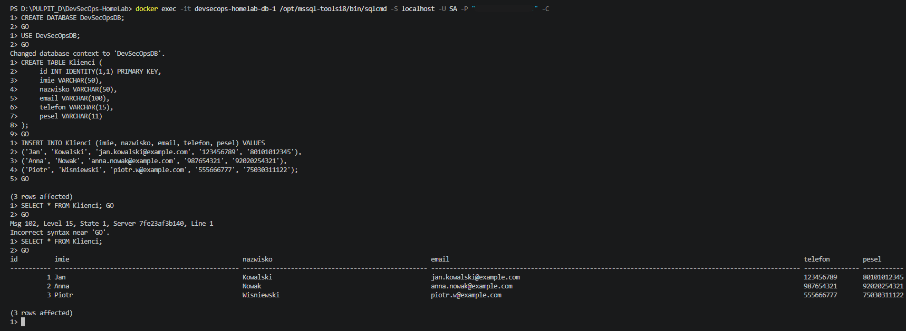

**3. Inteligentna anonimizacja danych (Python SecOps)**
> Wykonanie automatycznego backupu i zastąpienie danych wrażliwych (PII) realistycznymi odpowiednikami przy użyciu izolowanego środowiska wirtualnego (`venv`).

  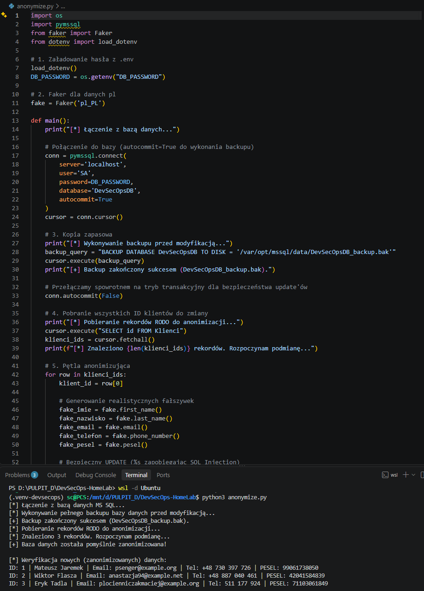

---

<b>🔥 ETAP III: Cyberbezpieczeństwo (Red & Blue Team)</b>

Kulminacyjny etap projektu, udowadniający skuteczność (oraz podatności) środowiska poprzez serię kontrolowanych ataków (Red Teaming), a następnie aktywną obronę za pomocą własnoręcznie napisanego systemu detekcji (Blue Teaming).

**🎯 Cel**\
Przeprowadzenie kontrolowanych testów penetracyjnych na własną infrastrukturę webową w celu zidentyfikowania luk, symulacja fizycznego zagrożenia wewnętrznego (Insider Threat), a następnie wdrożenie i przetestowanie autorskiego, lekkiego systemu detekcji intruzów (IDS) w czasie rzeczywistym.

**🛠️ Wykorzystane Technologie**\
`Kali Linux`, `Nmap`, `Nikto`, `Burp Suite`, `DuckyScript`, `PowerShell`, `Discord Webhooks API`

**🚀 Kluczowe wdrożenia**
* **Aktywny Rekonesans (Nmap & Nikto):** Zmapowanie sieci i wykrycie otwartych portów (w tym serwera Reverse Proxy oraz wystawionego na sieć lokalną portu 1433 bazy MS SQL, co stanowiło lukę konfiguracyjną) oraz zautomatyzowane skanowanie pod kątem brakujących nagłówków bezpieczeństwa (m.in. CSP, Strict-Transport-Security).
* **Eksploatacja Podatności Webowych:** Skonfigurowanie serwera proxy (Burp Suite), przechwycenie ruchu HTTP i skuteczne wstrzyknięcie ładunku SQL Injection (`' OR 1=1 -- `) omijającego logowanie administratora, a także weryfikacja błędu Cross-Site Scripting (XSS).
* **Physical Insider Threat (BadUSB):** Symulacja użycia Flipper Zero do błyskawicznej eksfiltracji wrażliwych plików konfiguracyjnych (plik `.env`) na zewnętrzny kanał webhooka, udowadniając ryzyko braku fizycznych zabezpieczeń stacji roboczej.
* **Cyfrowa Śledczość (Forensics):** Analiza potoku strumieniowego logów NGINX z wykorzystaniem PowerShella (przekierowanie strumienia błędów `2>$null` i wyrażenia regularne) w poszukiwaniu pozostawionych śladów włamania (IoC - *Indicators of Compromise*).
* **Autorski System Detekcji (IDS):** Opracowanie w PowerShellu w pełni funkcjonalnego systemu typu Intrusion Detection System. Monitoruje on na bieżąco strumień logów Dockera, a wykrycie złośliwych sygnatur (np. `<script>`, `1=1`, `nikto`) natychmiast wyzwala zabezpieczony przed Rate Limitingiem alert JSON do centrum operacji bezpieczeństwa (SOC) na Discordzie.

<b>📸 Proof of Work</b>

**1. Faza Rekonesansu (Information Gathering)**
> Skanowanie infrastruktury przy użyciu środowiska Kali Linux. Wyniki z Nmapa ujawniające strukturę sieci oraz logi ze skanera Nikto wskazujące na architektoniczne braki w NGINX.

  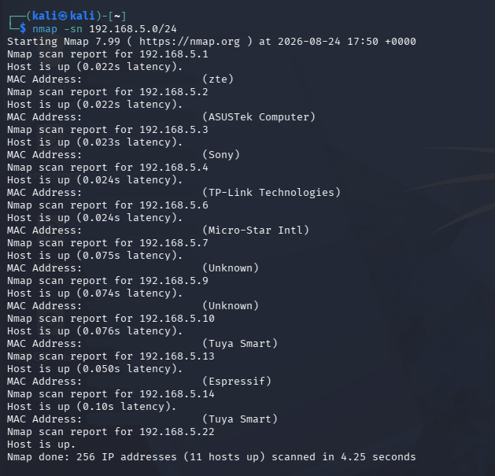
  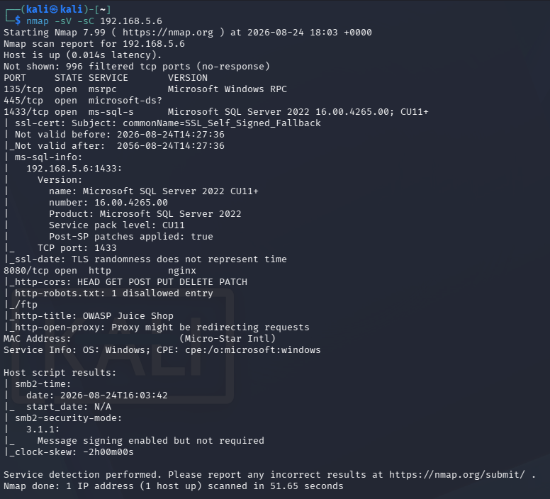

  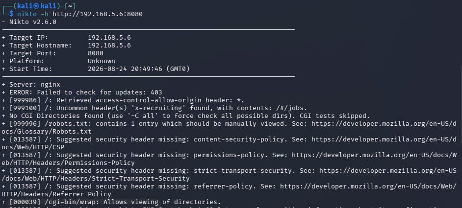

**2. Faza Eksploatacji (SQL Injection & XSS)**
> Przechwycone w narzędziu Burp Suite żądanie HTTP z ładunkiem SQLi, efekt przejęcia sesji konta 'admin' oraz wywołanie złośliwego skryptu (XSS) i listowanie otwartego katalogu na serwerze FTP.

  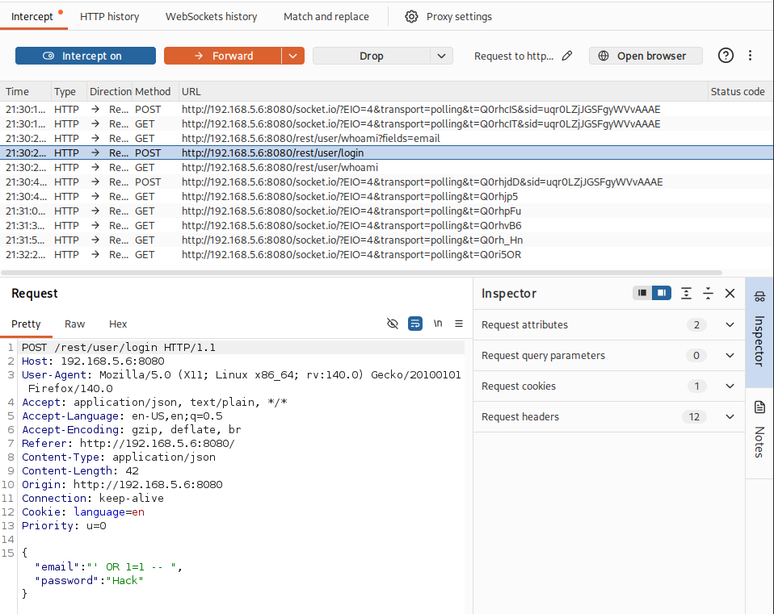
  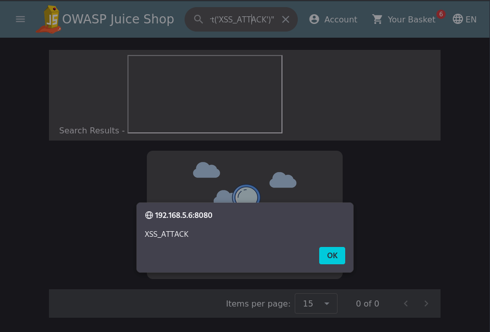

  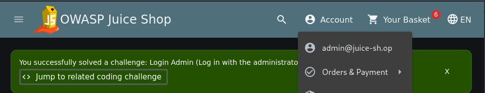
  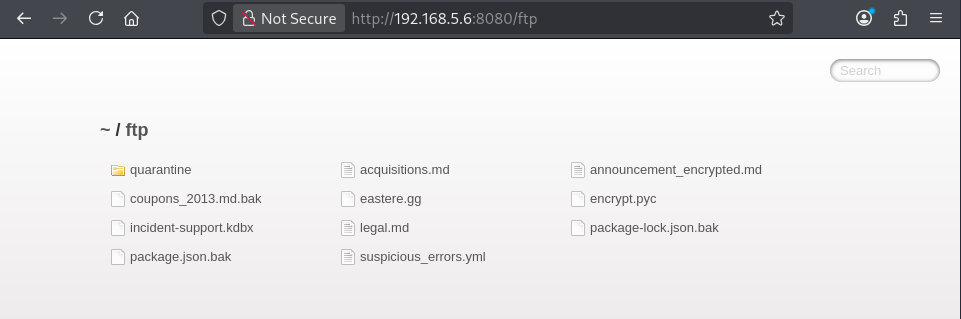

**3. Zagrożenie Wewnętrzne (Insider Threat - BadUSB)**
> Działanie payloadu fizycznego. Widoczny zrzut skradzionych przykładowych danych środowiskowych na zewnętrzny kanał Discord.
> *Rekomendacja mitygacji: Wdrożenie polityki Clean Desk (Win+L) oraz blokada nieznanych urządzeń typu HID przez systemowe reguły GPO.*

  

**4. Cyfrowa Śledczość i Detekcja (Blue Team / SecOps)**
> odfiltrowane ślady z logów Dockera, działający skrypt `ids_monitor.ps1` oraz natychmiastowe alerty o zagrożeniu dostarczone do zespołu SOC na Discordzie.

  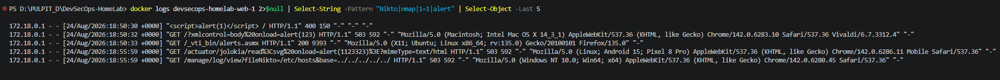

  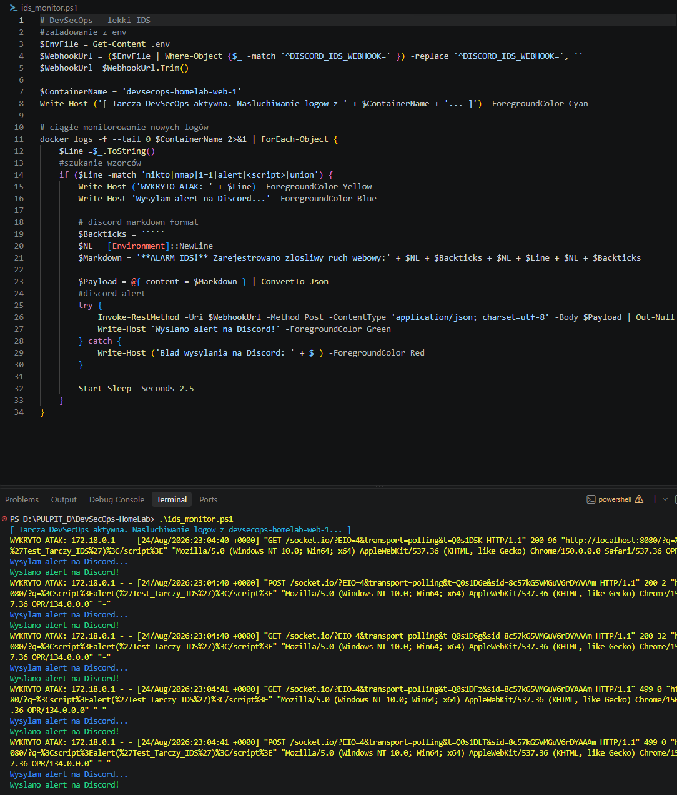
  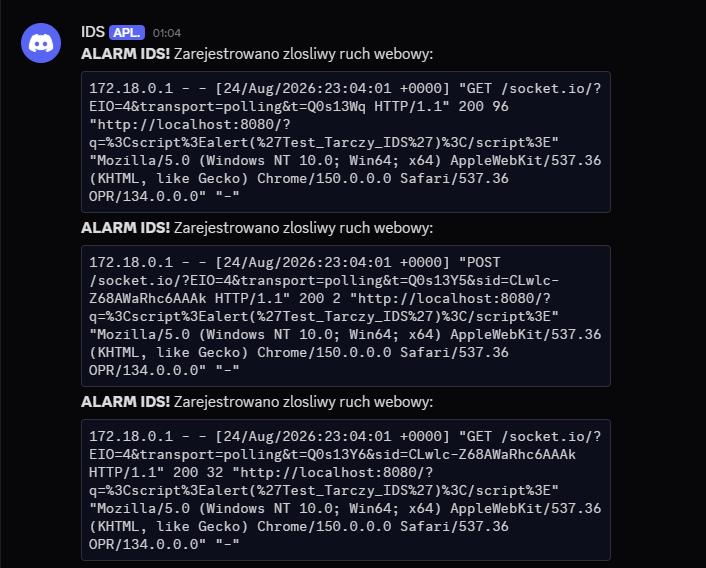

---

<b>🚀 ETAP IV: Automatyzacja Uruchomieniowa</b>

Ostatnim elementem projektu było zebranie całego ekosystemu w jedną, zautomatyzowaną całość, pozwalającą na wdrożenie infrastruktury jednym kliknięciem myszy.

**🎯 Cel**\
Stworzenie skryptu startowego, który automatycznie przygotowuje środowisko, rozwiązuje zależności i bezpiecznie uruchamia kontenery, zastępując konieczność ręcznego konfigurowania usług przez administratora.

**🛠️ Wykorzystane Technologie**\
`PowerShell (Skrypt startowy)`, `Docker CLI`, `Python PIP`

**🚀 Kluczowe wdrożenia (deploy.ps1)**
* **Bootstrapping Konfiguracji:** Skrypt analizuje obecność pliku `.env`. W przypadku jego braku, natychmiast zatrzymuje wdrażanie i automatycznie generuje bezpieczny szablon wymuszając na użytkowniku podanie danych uwierzytelniających.
* **Rozwiązywanie Zależności:** Skrypt weryfikuje środowisko Python i wykonuje automatyczną instalację pakietów (`pip install`) na podstawie pliku `requirements.txt`.
* **Smart Port Validation:** Wdrożenie radaru sieciowego (`Get-NetTCPConnection`), który przed startem kontenerów analizuje fizycznego hosta. Zabezpiecza to środowisko przed konfliktami i fałszywymi startami (False Positives), upewniając się, że porty 8080 i 1433 nie są blokowane przez inne usługi (np. Burp Suite).
* **Zarządzanie Demonem:** Automatyczna detekcja statusu usługi Docker Engine i próba jej aktywacji w przypadku wykrycia, że demon jest wyłączony.

<b>📸 Proof of Work</b>

> Spójne, ustandaryzowane logi systemowe (`[INFO]`, `[OK]`, `[BLAD]`) prezentujące udany proces rozwiązywania zależności, walidacji portów i ostatecznego, bezpiecznego podniesienia środowiska kontenerowego.

  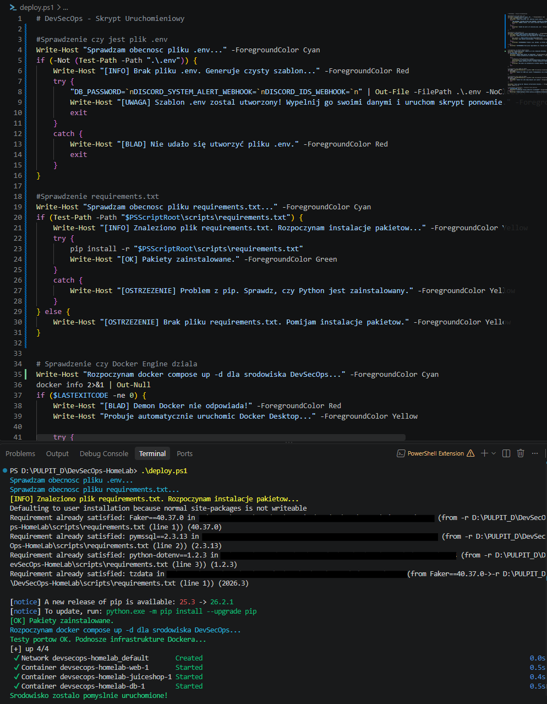

---

<b>📊 Podsumowanie i Wnioski</b>

Projekt **DevSecOps HomeLab** pomógł mi zrozumieć w praktyce, że bezpieczeństwo IT to ciągły proces. Zbudowanie tego środowiska od zera i przeprowadzenie przez nie pełnego cyklu testów było dla mnie świetnym przygotowaniem do dalszego rozwoju w stronę inżynierii bezpieczeństwa.

Czego bezpośrednio nauczył mnie ten projekt?
* **Praktyczne podejście do RODO:** Oskryptowanie bazy MS SQL w Pythonie pokazało mi, jak w realnym świecie chroni się dane użytkowników (PII) przed wyciekiem na środowiskach testowych.
* **Potęga Automatyzacji:** Napisanie własnego skryptu wdrażającego (deploy.ps1) uświadomiło mi, jak wiele frustracji oszczędza kod, który sam weryfikuje zajętość portów i dba o zależności przed uruchomieniem Dockera.
* **Podstawy Blue Teamingu:** Zbudowanie prostego skryptu IDS od zera i spięcie go z Discordem dało mi świetne fundamenty pod zrozumienie tego, jak działają prawdziwe zespoły SOC i systemy monitorowania logów.
* **Świadomy dobór narzędzi:** W projekcie celowo wykorzystałem różne języki skryptowe. Bash (.sh) posłużył mi do monitorowania zasobów wewnątrz środowiska Linux, gdzie narzędzia takie jak free czy top są natywne. Z kolei PowerShell (.ps1) został użyty do skryptu startowego oraz systemu IDS, aby natywnie i bezbłędnie komunikować się z systemem Windows i demonem Dockera działającym na maszynie hosta.
* **Audyt:** Wyniki skanera Nmap z Etapu III uświadomiły mi błąd w architekturze (wystawienie bazy danych na sieć LAN). Naprawiłem to, ustawiając port MS SQL wyłącznie do interfejsu localhost (127.0.0.1).

